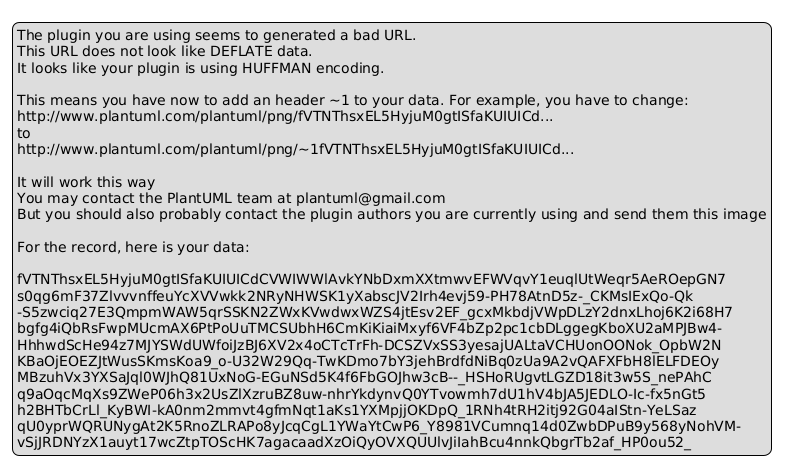
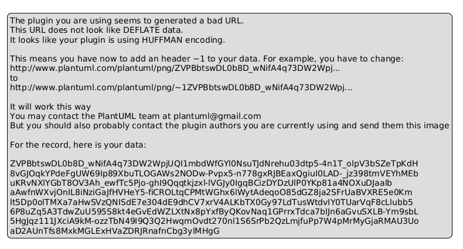
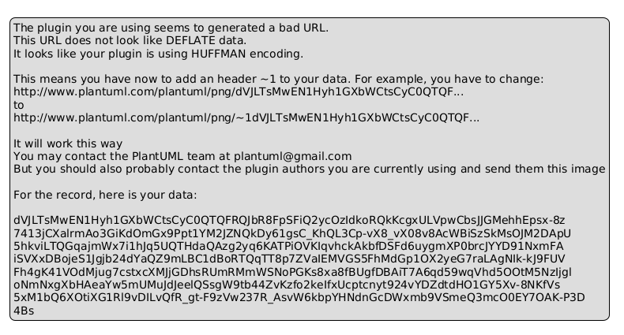

# LM Orders - Microserviço de Pedidos

## 📋 Visão Geral

Microserviço desenvolvido para gerenciar pedidos da LM Mobilidade, implementando arquitetura de microserviços com armazenamento híbrido e comunicação assíncrona.

## 🏗️ Arquitetura

### Padrões Utilizados
- **Domain-Driven Design (DDD)**: Separação clara entre Domain, Application e Infrastructure
- **CQRS**: Separação entre Commands e Queries
- **Repository Pattern**: Abstração da camada de dados
- **Mediator Pattern**: Desacoplamento através do MediatR
- **SOLID Principles**: Código limpo e manutenível

### Diagramas

#### Módulos e Dependências


#### Estrutura de Pastas


#### Fluxo CQRS - Criação de Pedido



## 🚀 Funcionalidades

### ✅ Implementadas
- **POST /orders**: Criação de pedidos com validação
- **GET /orders/{id}**: Consulta de pedidos com cache Redis (2 min)
- **Armazenamento Híbrido**: SQL Server + MongoDB
- **Eventos Assíncronos**: RabbitMQ para comunicação
- **Cache**: Redis para otimização de consultas
- **Validação**: FluentValidation para validação de dados
- **Testes Unitários**: Cobertura de casos críticos

## 🛠️ Tecnologias

- **.NET 8**: Framework principal
- **Entity Framework Core**: ORM para SQL Server
- **MongoDB Driver**: Acesso ao MongoDB
- **Redis**: Cache distribuído
- **RabbitMQ**: Message broker
- **MediatR**: Mediator pattern
- **FluentValidation**: Validação de dados
- **xUnit**: Testes unitários
- **Docker**: Containerização

## 🐳 Executando com Docker

### Pré-requisitos
- Docker Desktop
- Docker Compose

### Comandos
```bash
# Clonar o repositório
git clone <repository-url>
cd LMOrders

# Executar todos os serviços
docker-compose up -d

# Verificar logs
docker-compose logs -f lm-orders-api

# Parar os serviços
docker-compose down
```

### Serviços Disponíveis
- **API**: http://localhost:5000
- **Swagger**: http://localhost:5000/swagger
- **RabbitMQ Management**: http://localhost:15672 (admin/admin)
- **SQL Server**: localhost:1433
- **MongoDB**: localhost:27017
- **Redis**: localhost:6379

## 🧪 Executando Localmente

### Pré-requisitos
- .NET 8 SDK
- SQL Server (ou Docker)
- MongoDB
- Redis
- RabbitMQ

### Configuração
1. **Configurar connection strings** no `appsettings.json`:
```json
{
  "ConnectionStrings": {
    "Sql": "Server=localhost,1433;Database=OrdersDb;User Id=sa;Password=P@ssw0rd!;TrustServerCertificate=True",
    "Mongo": "mongodb://localhost:27017",
    "Redis": "localhost:6379"
  },
  "RabbitHost": "localhost"
}
```

2. **Executar a aplicação**:
```bash
cd src/LM.Orders.Api
dotnet run
```

3. **Executar testes**:
```bash
cd tests/LM.Orders.Tests
dotnet test
```

## 📊 Decisões Técnicas

### 1. **Armazenamento Híbrido**
- **SQL Server**: Dados principais do pedido (ID, Cliente, Status, Data)
- **MongoDB**: Itens do pedido (flexibilidade para produtos variados)
- **Justificativa**: Separação de responsabilidades e otimização de consultas

### 2. **Cache Redis**
- **TTL**: 2 minutos para pedidos consultados
- **Justificativa**: Reduz carga no banco e melhora performance

### 3. **Eventos Assíncronos**
- **RabbitMQ**: Comunicação com sistema de faturamento
- **Justificativa**: Desacoplamento e resiliência

### 4. **Minimal APIs**
- **Escolha**: APIs mais leves e performáticas
- **Justificativa**: Menos overhead para microserviços

### 5. **CQRS com MediatR**
- **Separação**: Commands (escrita) vs Queries (leitura)
- **Justificativa**: Escalabilidade e manutenibilidade

## 🔧 Endpoints da API

### POST /orders
Cria um novo pedido.

**Request:**
```json
{
  "id": "guid",
  "customerId": "string",
  "createdAt": "datetime",
  "status": "Created|Paid|Cancelled",
  "items": [
    {
      "product": "string",
      "quantity": 0,
      "unitPrice": 0.00
    }
  ]
}
```

**Response:**
```json
{
  "id": "guid"
}
```

### GET /orders/{id}
Consulta um pedido por ID.

**Response:**
```json
{
  "id": "guid",
  "customerId": "string",
  "createdAt": "datetime",
  "status": "string",
  "totalAmount": 0.00,
  "items": [
    {
      "product": "string",
      "quantity": 0,
      "unitPrice": 0.00
    }
  ]
}
```

## 🧪 Testes

### Executando Testes
```bash
# Todos os testes
dotnet test

# Com cobertura
dotnet test --collect:"XPlat Code Coverage"
```

### Cobertura de Testes
- ✅ Criação de pedidos válidos
- ✅ Validação de dados inválidos
- ✅ Cálculo de totais
- ✅ Mudança de status

## 📈 Próximos Passos

- [ ] Implementar logs estruturados (Serilog)
- [ ] Adicionar métricas (Prometheus)
- [ ] Implementar health checks
- [ ] Adicionar autenticação/autorização
- [ ] Implementar retry policies
- [ ] Adicionar testes de integração

## 👥 Contribuição

1. Fork o projeto
2. Crie uma branch para sua feature
3. Commit suas mudanças
4. Push para a branch
5. Abra um Pull Request

## 📄 Licença

Este projeto está sob a licença MIT. Veja o arquivo LICENSE para mais detalhes.